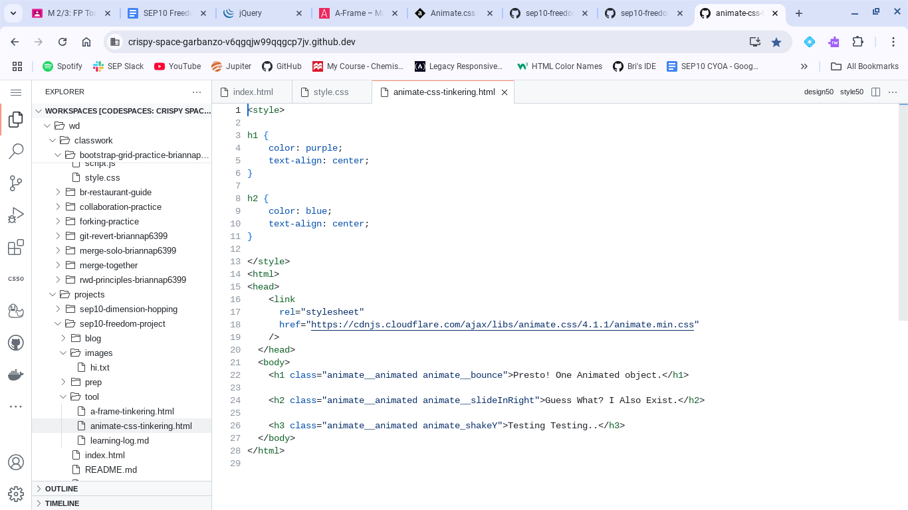

# Entry 4: Tool Acknolwedgment 
##### Brianna Peralta on Februrary 26th, 2025 (02/26/25)

## Content: 
We're finally in the big year of 2025, but that does not mean we're slowing down one bit. As soon as we finished finalizing our content, (look in [entry 3](entry03.md) for that) we started researching special Tools that we plan to use on our webpages. In terms that relate to SEP, Tools are essential small websites, of course relating to Computer Science, that offers some additional knowledge on a topic, such as using CSS to animate words, or using written HTML in order to create 3-D Objects. It sounds cool, and in all honesty, it really is. However, we are only limited to using 1 Webpage, in order to maximize what we learn from it. To do this, we were instructed to spend some time tinkering and playing with small aspects of a few websites, in order to get a feel of them, and by the end of our tinkering, we had to choose which website we wanted to move forward with. Then of course, we'd document it here as an entry, hence why I have this finished blog entry. So that now begs the question: *"Bri. Which Website did you end up choosing to focus more on?"* After a few days of thinking it over, and of course a bit of time tinkering with some websites, I think I have my definitive answer. But before we get into that, please note that I genuinely had fun tinkering with 2 out of the 3 Websites I had in my top 3, and while I admit I didn't focus that much on that 3rd Website, I still wish to look into it; Maybe not for SEP, but on my own time. But Regardless, my top 3 Websites were as followed:

* ### [A-Frame](https://aframe.io/)
* ### [Animate CSS](https://animate.style/)
* ### [J-Query](https://jquery.com/)

So upon further thought, the website I chose to focus on just so happened to be [Animate CSS.](https://animate.style/) Animate CSS, as the name implies, focuses on showing the viewer how to animate their Sentences, making them slide onto screen, or even appear out of nowhere. This may sound a little childish, but every time I go to the front page and see the website's name jump onto the screen, I feel a small bit of joy and even nostalgia, which honestly further helped me decide that I want to work with this website. 

## Thought Out Plan & EDP:
I know this might feel a little unusual, but for this Blog, I will be combining the EDP Portion of my Blogs with my tinker process ***and*** my Plans for Animate CSS. As of writing this, I mainly tinkered with Animate CSS through grabbing some of the sample code featured on the Website's main page, and modifying it with some of the properties that were featured by the animated title. For this specifically, I used the classes of `animate_bounce`, `animate_slideInRight`, and `animate_shakeY`. I also tried to time the duration of these animations using the `animate_duration` property. (I know it's not displayed in the picture, but it was added into the IDE at one point in time) The Image Below displays the HTML code that I used:

Anyways, I'd say I'm in the midst of Stage 4 of the Engineering Design Process, which of course is **Plan the Most Promising Solution**. Why am I on this stage, and instead of Stage 5 however? Upon learning of Animate CSS's abilities, a new and unique idea had come to my mind. I still want to use T.I.P.S, (The Imaginative Pencil for Scholars), but I also want to display it on my webpage. However, since I chose to focus on Animate CSS and not [A-Frame](https://aframe.io/), which main gimmick is all about using HTML Code to display 3-D Images, I decided to make my centerpiece of my webpage, besides of course my infomation, be a big sequence of HTML Code that comes together to make a 2-D model of T.I.P.S, all that can animate in near perfect sequence. I've debated on if I should include details of T.I.P.S with the HTML Code, but after considering the length of the details, I would much rather use physical features, or adjectives to describe T.I.P.S instead. For this, I plan to work extensively on figuring out how the `animate_duration` property works, as well as how I can angle my words using normal CSS. I know it'll be tricky, but I know for a fact that if it works as how I'm currently imagining it, it'll be a spectacle to the eyes, that's for sure!

## Skills Progress:
As tradition to my blogs, it is time to update you (the reader) on my progression with the Skills I wanted to focus on as established in the 1st Blog Entry. Just to jog people's memories, the Skills I wanted to focus on the most were **Advanced Researching**, (If I can be clever with the words I use in order to get the *exact* Information I need) **Flexibility**, (If I can *accurately adjust* in order to get over an obstacle or challenge I face) and **Time Management**. (If I can *organize* and *plan* out how much time I'd need in order to finish up something, whether it's a Project or Homework) Anyways, I think I've spoke enough about aall 3 Skills together, so why not go into the progression of each separately now?

### Advanced Researching: 
For Advanced Researching, small bits of progress has been made. While yes, I did dive into the 3 Websites I mentioned earlier in order to determine which Website I wanted to sink my teeth into, I admittedly did proritize only searching and wading through the first 2-3 Pages of a Website, rather not exploring all of it, mainly out of concern that I wouldn't have enough time to get to know all 3 Websites in time. Judging by the Website I picked to focus on however, I know for a fact that this small progression will surely grow bigger than even I could possibly expect.

### Flexbility: 
We have a similar case for Flexibility as well. While I was able to Navigate through the 3 Websites, Admittedly I did focus most of my tinkering on Animate CSS, with a bit of tinkering time going to A-Frame. I already had in mind that I wanted to prioritize and learn how to use Animate CSS over the other 2 Websites, but I honestly wish I gave a little more time to the other 2 Websites, that way I know more about how all 3 of them work respectively. Just like Advanced Researching however, I can see even greater progression in the upcoming future, as we dedicate more time to coding with our chosen websites.

### Time Management:
Just like the 3rd Blog Entry, I think most of my progression went towards Time Management, but if it was positive or negative, I'm honestly not entirely sure. I admit, I had some troubles spacing out when I should focus on tinkering with Animate CSS as well as writing this Blog Entry, but I've been able to balance out the tinkering and taking a few mental notes on the websites quirks. I've also noted how every animation class seems to work, with my favorites honestly being `animate_bounce` and `animate_tada`. Maybe when I'm creating my 2-D Pen 'Word Cloud' I could try to use Tada in order to get the pen in the right location? Then again, this is only some speculation, so truly anything could work in theory.

Overall, I'd say that not much progression has been made across the board. However, I'd say that this is fine, as I am jumping into a new and different portion of the Freedom Project; Istead of designating myself to solely research and typing, I will now be actively tinkering and planning out how I want to use Animate CSS's properties in order to make the Word Cloud. I'm definitely escited for when I start making progress on it!

## Conclusions and Goals:
That should be it for now. I doubt that this Entry will end up being more exciting as my lest entry, but I still think this entry is one of my most important yet. Especially now as we're getting deeper into the Project, and closer to the end of the School Year, we will start moving a little more rapidly, which I'd say I am prepared for. At least, for the most part. I already  have my plan for Animate CSS in mind, and I've considered going for a Purple, Grey, White and Black pallete theme for the final webpage, which I know for a fact will give the webpage a comforting, but also knowledgeable asthetic, which I think best fits Writing as a whole; People tend to Write out stories and Essays, as well as use a certain tone in order to get their message across. They can feel similarly to how a mother would read her child bedtime stories, or they could feel like how a Teacher would teach their students. Writing is expressive, but it also educates the reader or listener, whether on a personal and emotional level, or a factual level. That's what I love the most about writing, and why I personally want people to do it more. Anyways, this is officially the end of Entry 4. Thank you for reading, and hopefully I'll see you in Entry 5!.

[Previous](entry03.md) | [Next](entry05.md)

[Home](../README.md)
