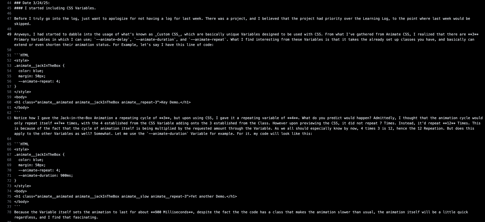

# Entry 5: Tool Learning
##### Brianna Peralta on April 11th, 2025 (04/11/25)

## Content:
Before we start, consider this: If you were given a job to hammer in a nail, and you prepared to do said job with a balloon animal, would you be able to complete the job? It could be done, I won't lie, but would it be difficult? Absolutely. As stated in the last blog entry, our progess on the Freedom Project relied on us tnkering, and eventually, learning a tool we selected. I've already said that I've chosen to use and learn [Animate CSS,](https://animate.style/) and I did mention what I wanted to do with Animate CSS, (Make a 2-D ['Word Cloud'](https://boostlabs.com/what-are-word-clouds-value-simple-visualizations/) with Animated Segments of HTML Code) but I truly cannot explain the struggle I had went through in order to even make this possible! I'll get more into the struggle later, though know that for Animate CSS, I genuinely learned quite a bit. There are these unique classes that I learned how to use, such as `animate__faster` and `animate__repeat-3`, as well as unique CSS Variables, which when combined with a class, can either Speed-Up/Slow Down your animation even more, or make it repeat several more times! I feel like this screenshot will give you more information than I have given right now:



The screenshot actually comes from a [Learning Log](../tool/learning-log.md) that I created in order to look back at what I learned from Animate CSS. For the most part, I've updated it weekly, and it's been a great help in recollecting my thoughts. 

## Thought-Out Plan & EDP: 
Just like Blog 4, I feel the need to combine these 2 portions together once more, mainly due to how deeply rooted both portions are together. Anyways, my method for tinkering with Animate CSS did alter a little from what was stated in Blog 4. Sure, I'd still pull samples of code from the actual Animate CSS, however I'd mainly try to experiment from scratch, using classes presented to try and put together strands of code. For the first few weeks of tinkering, I mainly focused on animating with phrases, and getting them to either speed up or slow down. I also deccided to give each sequence a different color, in order to tell them apart more easily. By the end of those few weeks, I had these strands to show my progress: 

```HTML
 <div class="col-md-6 one">
          <h1 class="animate__animated animate__bounce animate__infinite animate__faster royal-purple" id="bounce">Presto! One Animated object.</h1>
        </div>
       <div class="col-sm-6 col-md two">
        <h2 class="animate__animated animate__jackInTheBox animate__slow animate__repeat-3 sky-blue" id="jack-box">What if I tried you with another portion?</h2>
       </div>
       <div class="col-sm-6 col-md three">
        <h1 class="animate__animated animate__rollOut animate__fast animate__infinite pink" id="Pulse-1">Pen time?</h1>
       </div>
```
Notice how each strand's set of classes includes `animate__animated`. This important, since this class in particular allows for any strand of code, particularly any strands that want to use some other classes from Animate CSS, to be animated. Without `animate__animated`, the animations cannot activate properly. With that said, also notice how the 2nd Class has `animate_` as the first part of the class, but then also includes an unique word. That 2nd word determines what animation you want the strand of code to do. Some of these titles explain themselves, case in point with `bounce` simply msking the trand of code bounce up and down, but there are also more unusual titles, such as `jackInTheBox`. Nevertheless though, I recommend checking out all of the unique animations that Animate CSS has to offer, especially because of how diverse the pool of animations are. For the last few tinkering weeks, I decided to branch out, taking an idea featured in Animate CSS, that being the keyframes, and using more sources to better understand what could be done to animate. Using [Net Ninja's Keyframe Tutorial Video](https://www.youtube.com/watch?v=PjR97QzOrJM), I was able to realize how crucial the usage of `transform:` would be, mainly because it's needed to take a strand of code an animating it. For an example, look at this HTML Code:

```HTML
   <div class="even-circular"></div>
```
I'm trying to make this into a circle that starts to change in size upon hovering your mouse over it. To do this, I wrote these bits of CSS:

```HTML
.even-circular {
  background-color: #191970;
  border-radius: 55%;
  width: 300px;
  height: 300px;;
  margin-left: 70%;
}
.even-circular:hover {
background-color: #483D8B;
animation-name: grow-shrink;
animation-duration: 0.5s;
animation-iteration-count: infinite;
}
```
Notice how I gave the hover an `animation-name`, with that name being `grow-shrink`. No matter how you want to use Keyframes, you must assign a specific animation name. I honestly recommend that this name be 


[Previous](entry04.md) | [Next](entry06.md)

[Home](../README.md)
