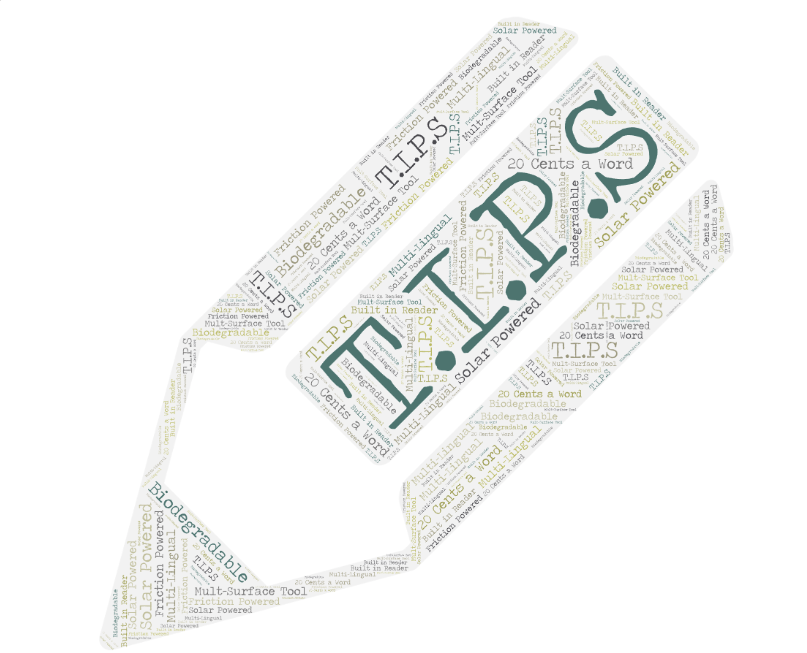

# Entry 5: Tool Learning
##### Brianna Peralta on April 11th, 2025 (04/11/25)

## Content:
Before we start, consider this: If you were given a job to hammer in a nail, and you prepared to do said job with a balloon animal, would you be able to complete the job? It could be done, I won't lie, but would it be difficult? Absolutely. As stated in the last blog entry, our progress on the Freedom Project relied on us tinkering, and eventually, learning a tool we selected. I've already said that I've chosen to use and learn [Animate CSS,](https://animate.style/) and I did mention what I wanted to do with Animate CSS, (Make a 2-D ['Word Cloud'](https://boostlabs.com/what-are-word-clouds-value-simple-visualizations/) with Animated Segments of HTML Code) but I truly cannot explain the struggle I had went through in order to even make this possible! I'll get more into the struggle later, though know that for Animate CSS, I genuinely learned quite a bit. There are these unique classes that I learned how to use, such as `animate__faster` and `animate__repeat-3`, as well as unique CSS Variables, which when combined with a class, can either Speed-Up/Slow Down your animation even more, or make it repeat several more times! I feel like this screenshot will give you more information than I have given right now:


The screenshot actually comes from a [Learning Log](../tool/learning-log.md) that I created in order to look back at what I learned from Animate CSS. For the most part, I've updated it weekly, and it's been a great help in recollecting my thoughts. 

## Thought-Out Plan & EDP: 
Just like Blog 4, I feel the need to combine these 2 portions together once more, mainly due to how deeply rooted both portions are together. Anyways, my method for tinkering with Animate CSS did alter a little from what was stated in Blog 4. Sure, I'd still pull samples of code from the actual Animate CSS, however I'd mainly try to experiment from scratch, using classes presented to try and put together strands of code. For the first few weeks of tinkering, I mainly focused on animating with phrases, and getting them to either speed up or slow down. I also decided to give each sequence a different color, in order to tell them apart more easily. By the end of those few weeks, I had these strands to show my progress: 

```HTML
 <div class="col-md-6 one">
          <h1 class="animate__animated animate__bounce animate__infinite animate__faster royal-purple" id="bounce">Presto! One Animated object.</h1>
        </div>
       <div class="col-sm-6 col-md two">
        <h2 class="animate__animated animate__jackInTheBox animate__slow animate__repeat-3 sky-blue" id="jack-box">What if I tried you with another portion?</h2>
       </div>
       <div class="col-sm-6 col-md three">
        <h1 class="animate__animated animate__rollOut animate__fast animate__infinite pink" id="Pulse-1">Pen time?</h1>
       </div>
```
Notice how each strand's set of classes includes `animate__animated`. This important, since this class in particular allows for any strand of code, particularly any strands that want to use some other classes from Animate CSS, to be animated. Without `animate__animated`, the animations cannot activate properly. With that said, also notice how the 2nd Class has `animate_` as the first part of the class, but then also includes an unique word. That 2nd word determines what animation you want the strand of code to do. Some of these titles explain themselves, case in point with `bounce` simply making the strand of code bounce up and down, but there are also more unusual titles, such as `jackInTheBox`. Nevertheless, I recommend checking out all of the unique animations that Animate CSS has to offer, especially because of how diverse the pool of animations are. For the last few tinkering weeks, I decided to branch out, taking an idea featured in Animate CSS, that being the keyframes, and using more sources to better understand what could be done to animate. Using [Net Ninja's Keyframe Tutorial Video](https://www.youtube.com/watch?v=PjR97QzOrJM), I was able to realize how crucial the usage of `transform:` would be, mainly because it's commonly needed to take a strand of code and animate it, though there are also some animations that don't require it. For an example, look at this HTML Code:

```HTML
   <div class="even-circular"></div>
```
I'm trying to make this into a circle that starts to change in size upon hovering your mouse over it. To do this, I wrote these bits of CSS:

```HTML
.even-circular {
  background-color: #191970;
  border-radius: 55%;
  width: 300px;
  height: 300px;;
  margin-left: 70%;
}
.even-circular:hover {
background-color: #483D8B;
animation-name: grow-shrink;
animation-duration: 0.5s;
animation-iteration-count: infinite;
}
```
Notice how I gave the hover an `animation-name`, with that name being `grow-shrink`. No matter how you want to use Keyframes, you must assign a specific animation name. I honestly recommend that this name be related to how you want your strand of code to be animated. For example, since I want the circle to grow and shrink in size, I thought it was appropriate to give it the name `grow-shrink`. Now, take a look at this last bit of code: 

```HTML
@keyframes grow-shrink {
  0%, 50%, 100% {scale: 100%}
  25%, 75% {scale: 200%}
}
```
To start the actual Keyframes, you need to include `@keyframes`, as well as the specific name you chose. Then, you input some basic changes. In my case, I wanted to animate the circle alternating in size. I made intervals of 25% repeatedly grow or shrink, and made sure when the animation reached 100%, the circle was the same size as before. This is the beauty behind Keyframes, one that I've admittedly struggled to find for quite a bit. Now going to the Engineering Design Process, I'd say I'm still in Stage 4, which as stated previously, is **Plan the Most Promising Solution.** Right now, my main goal, as mentioned previously as well, was to make the 'T.I.P.S' Word Cloud. I had originally thought that it could be done using the help of the animations, but I realized that by the end of the animation, the strands of code will be locked in a position that can't be changed unless I restart the code. This means that I would've had to rely heavily on a property that allowed for a fixed rotation for the other strands of code. Maybe I haven't searched hard enough, but I couldn't find a property that can do what I need. That doesn't mean I'm giving up on the Word Cloud though, and instead, I used an outside generator to create the word cloud, and I'll animate a screenshotted image to rotate upon the mouse hovering over it. Sure it's not exactly what I wanted, but it's better than nothing!



## Skills Progress:
Time for the Skills Update. Admittedly however, there isn't much to comment on for my 3 Selected Skills, which as stated before, were **Advanced Researching**, **Flexibility**, and **Time Management**. Because of how short my comments are going to be, I feel like I shouldn't give each Skill a paragraph as per usual, and instead, combine it all into one big section. For Advanced Researching, I must say, I want to applaud myself for finding the [Net Ninja's Keyframe Tutorial Video](https://www.youtube.com/watch?v=PjR97QzOrJM), especially because it helped clear up some confusion I had with Keyframes. Without it, I think I might've not been able to fully grasp the concept of Keyframes. For Flexibility, there's not much I can really say in all honesty. Sure, I didn't downgrade, but I also don't feel like I've progressed the skill. It's in the same spot it was in during Blog 4, and in all honesty, I'm just glad it didn't downgrade. Last but not least, Time Management. I'm glad to report that there was more progress on this. With our last week of tinkering, I was able to make a solid plan. It was so solid that I was actually able to finish everything on it rather quickly, with even a day to spare. It may not seem like much to someone, but to me, this is a big accomplishment.

Overall, not much progress was fully made, however, that doesn't mean that my progress has been downgraded. It's in the middle, and I'm glad that this leaves room for me to try and push myself harder when we start to work on the Wireframe for our Final Project, as well as the code for the Final Project as a whole. 

## Conclusions and Goals:
That should wrap up Blog 5. I think this was honestly the blog I've put the most amount of code in, so far at least. I hope that it didn't drag on too much, as I do kinda feel like I repeated some words in this. Anyways, what else is there more to discuss? I do have something I can bring up, though it's a change to a later plan. That of course being the palette for the website. Due to the colours of the T.I.P.S Word Cloud, I've decided to change the originally planned colors of Grey, White, Black and Purple to Blue, Yellow, White, Black and Beige. I hope this new change gives a better atmosphere, than if I just stuck to the original plan. Won't lie however, even this might change. It just depends on my thoughts, and of course, what looks best with the image itself. Anyways, this is officially the end of Blog 5. Thank you for reading, and hopefully I'll see you in Blog 6!

[Previous](entry04.md) | [Next](entry06.md)

[Home](../README.md)

