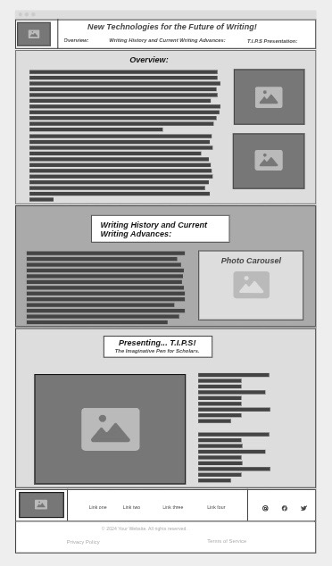
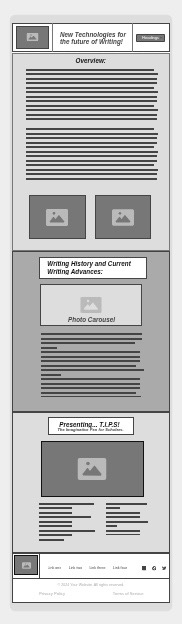

# Entry 6: Website Production
##### Brianna Peralta on May 8th, 2025 (05/08/25)
## Content:

As a wise man once said: [“Obstacles are those frightful things you see when you take your eyes off your goal.”](https://www.teamphoria.com/10-quotes-on-overcoming-obstacles-that-will-motivate-you/) This quote resonates with me deeply, and with what you will read here, I expect that you'd understand why by the end. Anyways for some background context, we had started coding our websites using everything we had been taught, as well as the additional tool that we selected to tinker with. Besides the obvious requirement of needing to make a website with your specific topic, you also need to make sure that it can easily adapt to multiple screens, like desktop and phone. You also had to use at least **2** [Bootstrap](https://getbootstrap.com/) Components, and with the wide library of Components Bootstrap has, I would honestly say this was the least of my worries. The Project was honestly assigned to us while I was on a Camping Trip with some other sophomores from my school, so I had to put into a way more intense situation compared to a lot of the other students in SEP, but I'm genuinely grateful that the end results turned out as well as it has. With that said, might as well dive into the later sections, no?

## Production Recalling + EDP Update:
This section might seem weird, but I feel like I should dedicate a special section to looking over everything I've done, now that the final project has been fully created. With that being said, the first thing I want to bring up honestly is the code for the 1st carousel. Before I even tried to attempt it, I caught myself tripping up on other sources of code and feeling as if I was in an inescapable trap. When I first attempted the Carousel, I genuinely sunk deeper. No matter what I did, I could never get it to activate as I wanted it to. As seen in this wireframe, I wanted it to be positioned next to where I spoke about different Writing Innovations:



But whenever I tried to add it in, I'd find the Carousel stacking on top of the Advances Paragraph (I used to have 2 Paragraphs for the section instead of the Accordions), as if it was trying to replicate the wireframe I created for the phone.



On top of the situation, I had way less time to actually finish the website, thanks to the Camping Trip I had mentioned earlier, so I admittedly did miss the deadline. I can recall myself breaking down, late at night, while trying to figure out what I should do. I felt stranded, and I was scared to ask for help but I had no other choice: It was either fail the project, or ask for help. I had eventually mustered up the courage to do so, and exactly on Wednesday, May 7th, I had patiently waited for my Software Engineering teacher to come nearby before raising my hand and explaining a little bit of my situation. He pulled me to the smartboard, and, through images, advised me to use this strand of code:

```HTML
<div class="container">
 <div class="row">
  <div class="col-md-5">
```

I genuinely recall feeling a big wave of emotions conflict in my head: On the one hand, I felt stupid and even a little ashamed that I forgot about [Bootstrap's Grid System](https://getbootstrap.com/docs/5.3/layout/grid/), especially with the amount of time we had spent on it. On the other hand however, I felt nothing but determination. I quickly plugged that strand of code into what I currently had and from there, just built on. As soon as I got home from school, I went onto my laptop and tried to weave the content into my website. When I had to go to work, I spent most of it on the computer, typing away. Just seeing the code my Computer Science Teacher hinted at me to use gave me such a big confidence boost that I was able to rehaul everything and finish the MVP for the Website by that same night. It might honestly not seem like much to some people, but I felt incredible. I felt unstoppable too. I really was unstoppable as well.. Mostly. There is a small problem I have with the background, as I originally wanted it to be multi-colored (As in, one section of the website is a lighter yellow, another section is a darker yellow, and that cycle continued), but I don't think I had the proper `<div></div>` set-up for it, so it was scrapped last moment. I was also going to add a button at the bottom of the webpage, so that it'd take you right back to the top of the website, but I had quickly scrapped that, in favor of making a 'Fixed-Navbar', meaning that wherever you moved, it'd move with you. Overall, it has been a rollercoaster trying to work on the website as well as following the **Engineering Design Process (EDP)**. Speaking of which, I'd say I'm on the 7th Step now? That being to Improve the Prototype based on testings and feedback, which I did in fact get. I'm back on track, and I'm grateful I am.

## Skills Progression:
This is weirdly becoming a trend, but I can't really say much here other, and what I can say would be a repeat of what was stated in the previous 2 Sections. Time Management didn't really change, since I barely had time to produce the website, so I defaulted to trying to get everything down. Advanced Researching I can kind of say something for, with that of course coming from myself asking for assistance and getting the 'Carousel Strand' as I'm now calling it. However, is it truly Advanced? That is what I'm not sure about. Regardless however, most improvement this time goes to Flexibility. As stated earlier in **'Production Recalling + EDP Update'**, I was flexible in regards to my stressful situation, and of course the multi-colored background. Other than that however, I don't know what else I should add. Apologies to everyone reading.

## Conclusion:
With everything said, that wraps up Blog #6. There was a lot to talk about, but at the same time, it barely felt like a lot. Honestly though, that's completely fine? At least there's something, and that's better than nothing. Now that the website has been finalized, we will now be working on Presentations, and making sure everything is in top shape until the Expo, which is later this month. I feel excited for it, but I also feel a bit of fear, since I have a bad habit of stuttering whenever I feel nervous. Whatever the case is though, it will be crucial, especially if I somehow make it into the showcase that's happening in June. Kinda doubt I would, but if I do, then it's a happy day. Now with that said, thank you for reading this Blog, and hopefully I'll see you in the next one! .. If there is another at least; Not too sure.

[Previous](entry05.md) | [Next](entry07.md)

[Home](../README.md)
