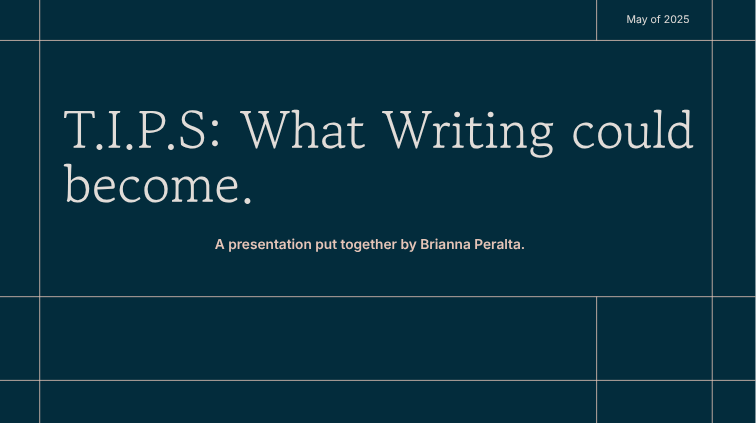
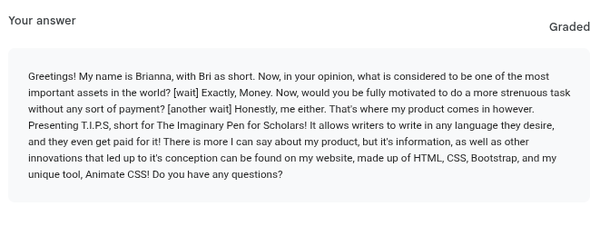

# Entry 7: Presentations; In-Class & Elevator Styled
##### Brianna Peralta on May 26th, 2025 (05/26/25)
## Content:
Well, this is it. Not only is this the last blog of the school year, but the creation of this also highlights that all of our work is in a sense, basically completed. Now that the [Final Website](https://briannap6399.github.io/sep10-freedom-project/final-project/index.html) was created, and with the SEP Expo, a day where students all across SEP Display their course long project for not only judges, but also teachers and staff to see, officially happening on **May 29th**, all that was left to do was create our presentations. These presentations were made to not only demonstrate and talk more personally about our website, but they were also made in order to develop what's arguably one of the most important skills in our lives; Public Speaking. As my teacher said: [*'This course will teach you how to give presentations, and stand in front of an audience, like I do everyday.'*](https://github.com/bmuellerhstat) Going into the creation of my presentations, I was admittedly a little anxious to talk about how much I struggled with forming the structure of the website, however, I also felt a bit of excitment, since the creation, and eventual sharing, would allow my fellow students to get to know what I created. We had about 3-5 Days to construct a 3-10 Minute long Presentation which as said previously, would be shared to other students, but after that, we also had to create an ['Elevator Pitch',](https://careerdevelopment.princeton.edu/sites/g/files/toruqf1041/files/media/elevator_pitch.pdf) which would directly be used for the SEP Expo. Because of how many presentations needed to be made, and how quickly the Expo was coming up, the pressure was on, and I was trying to ensure that I still remained on top. Would I say I managed to remain on top? To say the least, my answer is a bit complicated.
## Presentations Overview + EDP Update:
Since we had to work on the presentation that needed to be more personal first, my classmates and I were pushed into a position where we had to look over our websites as a whole, and the processes behind them; Specifically, we needed to talk about what went into making it, what struggles we had, and of course, what were our own takeaways from the experience. Based off of that idea, I decided to bring up a few concepts; My thought Process behind my topic (how I chose it over Education and Photography), and my struggles, which allowed me to bring up what I call the 'Carousel Strand', which I brought up in the 6th Blog. Below this miniature paragraph is the front cover of my In-Class presentation, and upon clicking it, you should be sent to the actual presentation itself (There might not be a lot on the slides, but that's because I wanted the presentation to be mostly verbal):

When I was presenting this publicly, I had recieved a lot of positive feedback, with some being as simple as my slides look well designed, all the way to my presence in front of the class was what should be seen during a presentation. That's not to say I didn't get any critique however; One comment that especially stook out to me was how it felt like I was selling *T.I.P.S* (My future innovation for Writing) more than my actual website. Looking back now, I can see where that comment comes from; Admittedly, I was, and still kind of am, confused on what the 'Product' part of the presentation should be, as both the website, and my future invention itself were products. I got similar feedback on my Elevator Pitch as well, which is basically a much shorter presentation compared to the In-Class one, which once again, there will be an image below this mini paragraph that shows the draft of it:

My main goal with the Elevator Pitch was to make my 2 Products flow more smoothly together, and show how 1, (My Website) ended up impacting my future invention (T.I.P.S). However, I am able to see that I did favor one idea more than the other with this presentation as well, which leads me to the conclusion that I should work on balancing out my points whenever I present in the future. Due to this, and of course my progression through the course as awhole, I'd say I'm now on the last step of the **E**ngineering **D**esign **P**rocess (EDP), which simply states *'Communicate the Results'*. I do got to be honest, as I believe I was a little confused with the EDP, so that is my mistake, but I am glad that everything was able to still flow as necessary.
## Skills Development:
Good News! I can finally make different sections for each skill, as not only is there a lot for me to bring up about each of my 3 skills, but I also feel like I have more positive opinions about them than I normally would. Might be because this part of the SEP Course was one of the most important in my life, but I'm still grateful. So with that said, let's go in Alphabetical Order, starting with ***Advanced Researching***. 
### Advanced Researching:
### Flexibility:
### Time-Management:
## Final Thoughts: 

[Previous](entry06.md) | [Back to Beginning](entry01.md)

[Home](../README.md)
